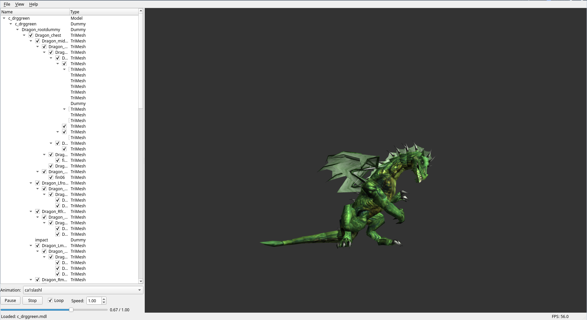

# Borealis NWN Model Viewer



A 3D model viewer for Neverwinter Nights MDL files. Supports binary and ASCII MDL formats with animation playback, material/texture rendering, and model inspection.


## Features

- Binary and ASCII MDL format parsing
- Model decompilation to ASCII
- Animation playback with keyframe interpolation
- Skinned mesh rendering with bone transforms
- Particle system support
- TGA, DDS, and PLT texture formats
- Model tree view for hierarchical inspection
- MDL source viewer with syntax highlighting

## Requirements

- C++23 compatible compiler (GCC 13+, Clang 17+, or MSVC 19.36+)
- CMake 3.28+
- Qt6 (Core, Gui, Widgets, OpenGL, OpenGLWidgets)
- OpenGL 3.3+

## Installing Dependencies

### Debian / Ubuntu

```bash
sudo apt install cmake g++ qt6-base-dev libqt6opengl6-dev libgl1-mesa-dev
```

### Fedora

```bash
sudo dnf install cmake gcc-c++ qt6-qtbase-devel mesa-libGL-devel
```

### RHEL / CentOS / Rocky / Alma

Enable EPEL and CRB repositories first, then:

```bash
sudo dnf install cmake gcc-c++ qt6-qtbase-devel mesa-libGL-devel
```

## Building

```bash
git clone --recurse-submodules https://github.com/varenx/borealis_nwn_model_viewer.git
cd borealis_nwn_model_viewer
cmake -S . -B build
cmake --build build
```

GLM, fmt, and spdlog are fetched automatically via CMake FetchContent.

## Usage

```bash
./build/borealis_nwn_model_viewer                    # Open the viewer
./build/borealis_nwn_model_viewer path/to/model.mdl  # Load a model on startup
```

## License

Copyright 2025-2026 Varenx. Licensed under the GNU General Public License v3.0. See [COPYING](COPYING) for details.
